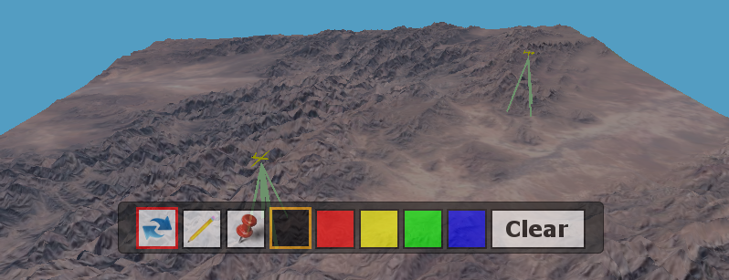

About
=====================
---------------------

The Virtual World Framework (VWF) is a fast, light-weight, web-based architecture for creating and distributing secure, scalable, component-based, and collaborative virtual spaces. It leverages existing web-based standards, infrastructure, and emerging technologies with the intent of establishing a powerful yet simple to use platform that is built on top of the next generation of web browsers. These technologies include:

* HTML 5 – a significant upgrade in expressive power for the web
* WebGL – an integrated 3D graphics capability
* WebSockets – providing a full TCP/IP connection between the client and server
* JavaScript – the programming language of the web  

The application below provides the basic functionality achievable with the VWF. It is representative of a sandtable, allowing a user to navigate the environment, place push pin markers, and draw on the terrain. In additional, 2D HTML components are used in conjunction with the 3D environment in order to change colors and select tool mode. Click the image to launch an instance of the application.

The VWF serves as a replicated computing platform for multi-user interactive 2D and 3D components with a high degree of customizability of the environment and high bandwidth communication between users. These are environments that are focused on work and working together – whether for training, collaboration and/or entertainment. It is a zero-install platform, where additional software components can be added dynamically. VWF spaces can be embedded in virtually any application including web pages and emails. Furthermore, VWF spaces can embed existing applications and browsers. The next big 3D platform is simply the current world wide web with additional capabilities, and the Virtual World Framework embraces this ever growing technology.