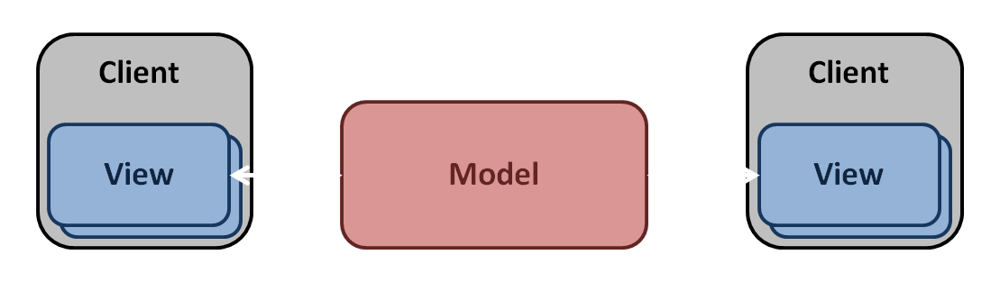
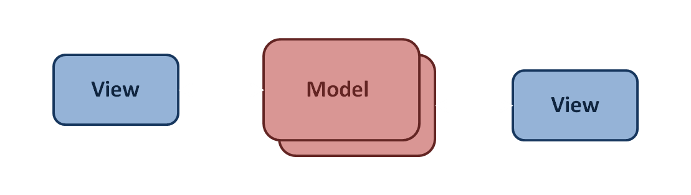
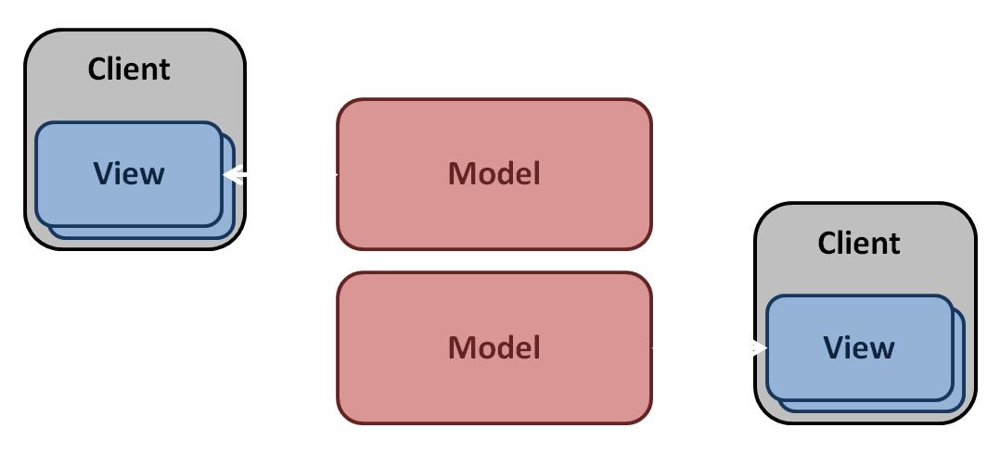
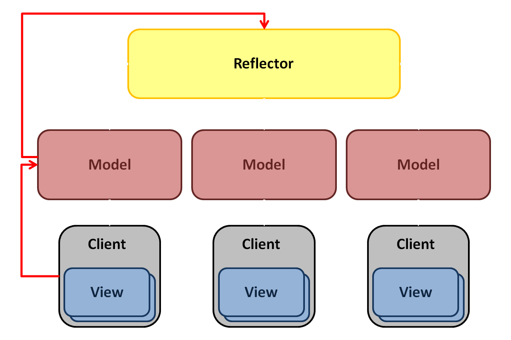
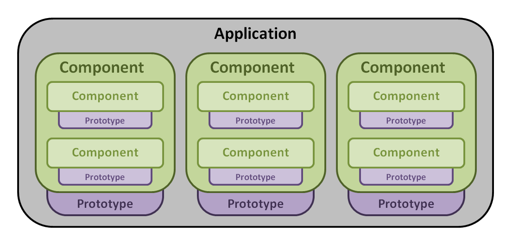
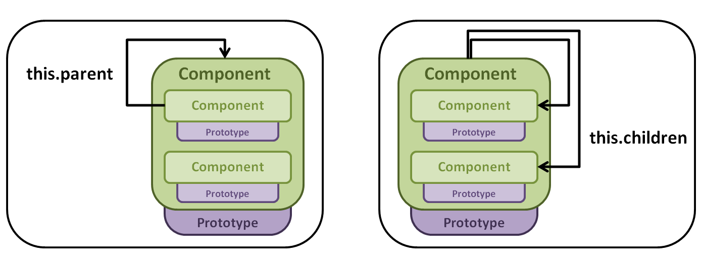

Architecture
===================
-------------------
The architecture behind the Virtual World Framework is by design:

* Fully web-based
* Component-based
* Multi-user collaborative

The VWF architecture allows an application developer to focus on creating content in the mindeset of a single user application. Provided development is performed using the standard framework conventions, there is nothing additional to do in order to achieve a synchronized state across multiple users in the environment. 

-------------------

**Collaborative Nature**

The Virtual World Framework is a model - view based architecture. Views exist for each client joined in the application. Each view provides input into a model that keeps track of the state of the simulation. 

A client's browser may have multiple views. For example, a user may see and renderer view and an editor view in their browser window. The renderer view shows a 3D visualization of the model state, and the editor view shows the hierachy of the scene and the pieces that make it up such as it's properties and children.

The single model, or shared state, of the application has multiple copies that represent the shared simulation. 

Each client then has their own replicated model that they take with them. The model, however, remains the same as the one that every other user is viewing. The application then is a state machine. The same state machine is in different locations (different clients). If the state machines all have the same properties and children, they will all move to the same successive state.

External inputs from one user get thrown "across the moat" into the "shared simulation." The model deflects incoming input from a view, and sends it directly to the reflector. The reflector can then send out the information to all of the replicated models. Thus all inputs to a model happen identically on the timeline to all clients within the application. 

The architecture separates external input from internal input. All external input (ie. user input from a view), once received by the model is deferred to the reflector, which then sends it out to everyone. However, the model is free to make any additional state changes (ie. internal input) provided that it was caused by something internal to the model. This would include things such as setter methods that can manipulate other internal properties. 

-------------------

**Component Structure**

A VWF application is made up of components. Each component in the system is built up from smaller components or prototypes within the user's programming space. The [components](components.html) section provides further detail about creating application components, and the [prototypes](prototypes.html) page describes the VWF base types. 

Components can interact with one another via scripts in the application. The use of parent and children keywords such as *this.parent*, *this.children*, *this.parent.children*, and so on can be used to trace through the hierarchy. 

-------------------

**The Drivers**

We've discussed how to write an application using the framework. The next section describes how the system works, and how to reconfigure the system to accomplish more complex tasks. The drivers of the system are the things that connect components to the 3D visualization and the user interaction that you see. 

The drivers define the autonomic actions that happen within a system, dividing responsibility and delegating work for each action of the system. These actions include things such as creating or deleting a node, getting or setting a property, calling methods, and firing events. Please reference the [API](system.html) for a complete list. The drivers stand side by side without direct interaction between them. Rather, they interact by autonomic actions that the kernel manages. 

For example, the GLGE driver is responsible for any manipulation on the node that's part of the scene, like setting the translation of a node. This information may be ignored by the rest of the drivers if it is not needed. 

Model and view drivers have the same structure; however, the model driver doesn't reach out, and a view driver does not have direct control. 

For more detailed information regarding the drivers, please references the [drivers](drivers.html) page.

--------------------

