Editor
===================
-------------------
The editor capability of the Virtual World Framework allows for the application to be edited in a live environment. It provides full control to the user and has the ability to navigate through the current state of the application, consisting of its various nodes and properties. The editor allows changes to be made to the shared simulation by setting properties, calling methods, and firing events. 

-------------------

Opening the Editor
-------------------

To open the editor interface, move the mouse to the upper ride side of the screen. Upon a mouse rollover, five editor tabs should be displayed. Selecting one will open the editor on the right hand side of the screen, pushing the application view to the left.

The editor consists of five tabs:

* Application
* Users
* Time
* Models
* About

To close the editor, rollover just to the left of the upper left corner of the editor. The five tabs will appear as well as an *X* tab. Click on the *X* tab to close the editor interface. 

-------------------

Application
-------------------

The Application tab displays a list of all children, properties, methods, events, behaviors, and scripts in the application. In addition, this tab provides a drill down capability on selected items, allowing complete navigation of the scene structure. Some items can also be edited directly with text based inputs.

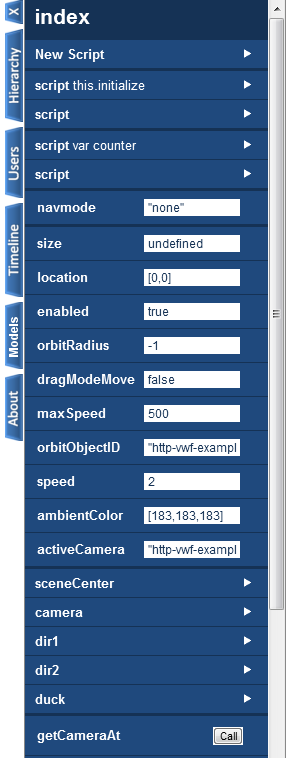

**Properties**

All properties of a given node can be edited while the application is running. Using the editor interface, drill down into the appropriate node, or find the property in the application's property list. The property value can simply be edited by entering or changing the value and clicking the *Enter* key.

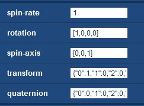

Properties may be booleans, numbers, or strings, and their values are represented in form they would be as a javascript format. Strings must be quoted, and arrays must be intered in the form of *[ 0, 0, 0 ]*. Values can also be null or undefined.

**Methods**

All methods associated with the current node are listed in the editor. They can be called directly from the main window, if they do not require parameters, by clicking the *Call* button. If parameters are required for a method, a white arrow will appear by rolling over the right of the *Call* button. Clicking the white arrow will drill down into the method, and parameters can be specified in the given text fields. The *Call* button can then be clicked from the header. To go back to the node, select the white back arrow in the upper left corner. 

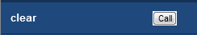
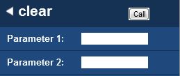

**Events**

All events associated with the current node are listed in the editor. They can be fired directly from the main window, if they do not require parameters, by clicking the *Fire* button.  If parameters are required for an event, a white arrow will appear by rolling over the right of the *Fire* button. Clicking the white arrow will drill down into the event, and parameters can be specified in the given text fields. The *Fire* button can then be clicked from the header. To go back to the node, select the white back arrow in the upper left corner. 

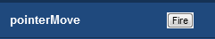
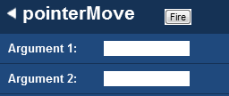

**Children**

All children of the current node are listed in the editor, and each can be drilled into to see a level deeper in the tree structure. Each child node is marked with a white arrow to the right of the child's name. Click on any child in the list in order to drill down. The new node information will be displayed including any scripts, behaviors, properties, children, methods, and events associated with the node. 

**Behaviors**

Behaviors can be attached to any node in the scene. For all nodes with behaviors, upon drilling into the selected node, a list of all implemented behaviors will be displayed. 

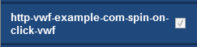

**Scripts**

Scripts can be both created and edited in the editor interface. 

*Creating New Script*

To create a new script on a node in the application hierarchy, click on the *New Script* item listed first. Click in the text area that appears to give it focus. The editor window will expand to allow more room for typing the script. A new script can be added here that extends an existing function, for example, mouse events, or can be brand new. Once the script is ready to go, click on the *Create* button at the bottom of the editor. To exit to script editor, either close the editor by selecting the *X* tab or selecting the back arrow in the upper left corner to drill back up to the node. 

*Editing Script*

To edit an existing script, click on the corresponding script listed in the editor on the appropriate node. The script editor will open, displaying the current script. Click in the text area to expand the editor working area. Make any updates as needed, and click the *Update* button at the bottom of the editor. To exit to script editor, either close the editor by selecting the *X* tab or selecting the back arrow in the upper left corner to drill back up to the node. 

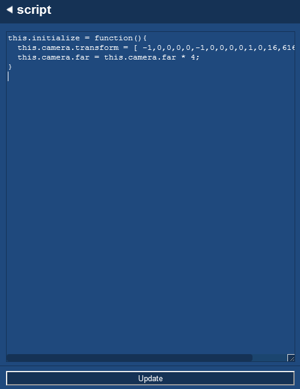

-------------------

Users
-------------------

The Users tab shows a list of all user IDs currently in the application instance.

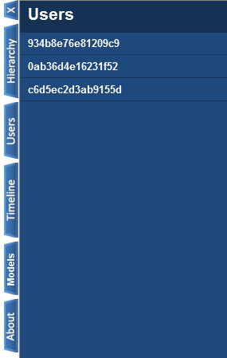

-------------------

Time
-------------------

The Time tab contains a pause and stop button which, when pressed, will pause and stop the application clock, respectively. In this case, the pause button will change to a play button which will allow the clock to be started again. Additionally, the Timeline tab also allows the clock speed to be adjusted to be faster or slower, depending on where the slider is dragged. The rate will be numerically displayed below in relation to the normal time.

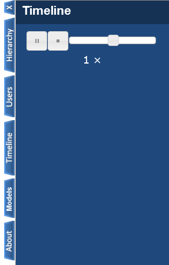

-------------------

Models
-------------------

The Models tab is a listing of assets on the server that are available for dragging into the application, creating new children in the scene. Upon opening the tab, a list of all available models on the server is displayed. Clicking on any of the listed models will drill down into that model, allowing the user to set properties of the node to be created, including the rotation, scale, and translation offset (distance from the drop location). After setting these properties, the user can then drag the *Drag to Create* area and drop it on any location in the scene. Upon the drop, the new object will be created with the specified properties. 

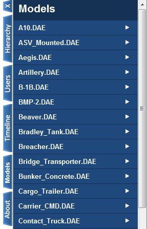
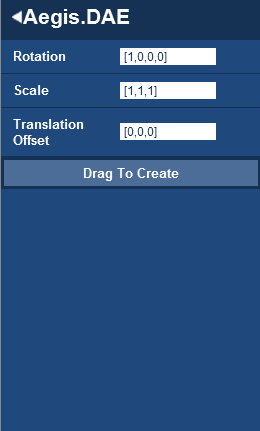

-------------------

About
-------------------

The About tab displays the current version of the Virtual World Framework used in the application, where the first number describes a major release, the second a minor release, the third a patch, and finally, the revision number of the build. The tab also contains links to the main webpage and github repository for user reference.

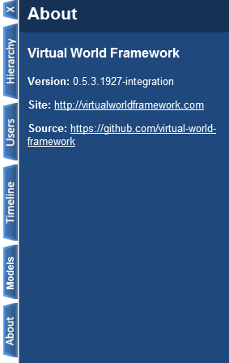

-------------------

