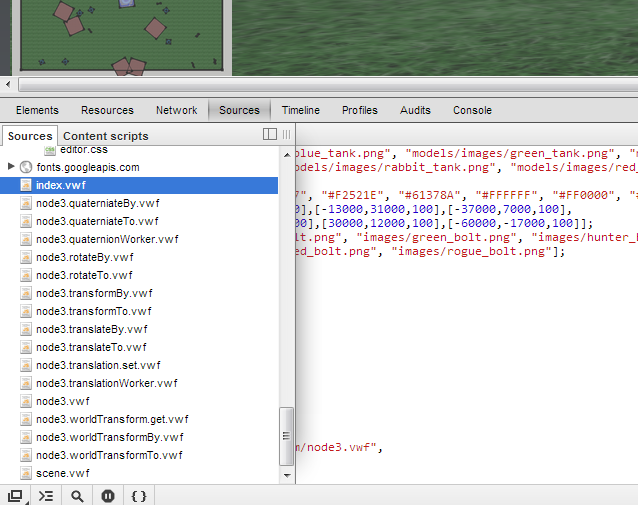

<a name="logging" />

Logging and Debugging
==============
--------------

As you're building applications in the framework, it often helps to be familiar with the different logging and debugging tools available, both built into the browser as well as in the framwework. 

--------------

### Logging

**VWF Logging**

The logging levels are defined in *support/client/lib/logger.js*, documented under [logger](jsdoc/module-logger.html) in the [system API](system.html). The logging options are TRACE, DEBUG, INFO, WARN,  and ERROR. This module requires the configuration module, defined in *support/client/lib/vwf/configuration.js*. The default log level on a development server is **info** and the default log level on a production server is **warn**. These values can be updated in the configuration.js file. 

Logging is preferred over generic console output(e.g. *console.error*), as console output can cause the browser to crash if proper debugging tools are not installed. 

The loggers can be used throughout the framework and have a knowledge of their context, or the object to which they're attached. The following example will output the context of the message followed by the message itself.

	this.logger.warn( message );

While the above example shows the most common type of logger message, the "x" variants are available for specifying deeper context, such as a specific function name. In the following example, the logger message adds an extra one-time label before the message. 

	this.logger.warnx( "someFunction", "This message is coming from someFunction." )

This type of message is primarily for the kernel and drivers, and most likely is not relevant for components. 

**Log Files**

Turn logging to files on in *lib/vwf/application/reflector.rb*. Setting the *if* statement to true in the *def log* area will log events to a directory under "log/". The path will match the application's location in "public/" plus application/instance/client. Messages are logged to a separate file for each unique time stamp.

	def log fields, direction
	  if true 

This form of logging is a heavy operation and should only be used for trace-level debugging. This option is planned to be configurable, so the reflector will not need to be edited. At it's current state, if this option is set to true, the server will need to be restarted to begin logging. 

--------------

### Debugging

**Browser Console**

Open the developer console to check for any information and error messages. 

* In Mozilla Firefox, download and install [Firebug](https://addons.mozilla.org/en-us/firefox/addon/firebug). Select the bug icon in the upper right of the browser to run, and then select the Console window. 

* In Google Chrome, press Ctrl+Shift+J or select the tools menu -> Tools -> Developer Tools -> JavaScript Console. 

Additionally, in Chrome, the *Elements* tab allows browsing the HTML of the document. *Network* allows for viewing of network traffic. *Sources* allows for browsing the javascript and css associated with the application. *Profiles* has an option for collecting the JavaScript CPU profile, which can be helpful in optimizing your VWF application. 

**Model Source**

By adding "//@ sourceURL=*file reference*" to the end of scripts in the model file as show below, the script functions will be available in the *Sources* tab of the browser console. From here, breakpoints and other debugging tools can be used. 

	scripts:
	- |
	  this.initialize = function() {
	    doSomething();
	  } //@ sourceURL=index.vwf

--------------
