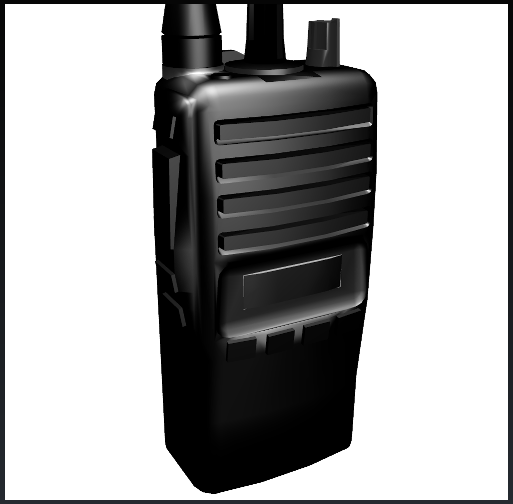

<a name="simulation" />

Create a Simulation
===================
-------------------

Let's define a *simulation* as any application that models a sequence of causes and effects.  Here's how to create one:

## Load the 3D scene

Let's use the 3D model of a radio that comes with the VWF source in /public/radio:

Let's load it in our index.vwf.yaml file:

	---
	extends: http://vwf.example.com/navscene.vwf
	children:
	  radio:
	    extends: http://vwf.example.com/node3.vwf
	    source: radio.DAE

## Add a behavior to an object that reacts to user interaction

A *behavior* is a component that can be added to another to give it added functionality.  Once created, these behaviors can be reused like building blocks, making it faster to create your applications.  Luckily, someone has already written a *control* behavior that we can reuse.  Let's put it on the volume knob, inside the radio 3D model.

Hold down the Alt key and click anywhere in the scene; the console will print the hierarchy of the scene in both yaml and json format.  Copy and paste the yaml into your application document (unfortunately, it will bring the console line numbers with it, but they are all identical, so a string replace can rid you of them easily).  Here is a subset of it below with the behavior added to the *ic40Volume* node:

	---
	extends: http://vwf.example.com/navscene.vwf
	children:
	  radio:
	    extends: http://vwf.example.com/node3.vwf
	    source: radio.DAE
        children:
          Radio:
            extends: http://vwf.example.com/node3.vwf
            children:
              ic40Volume:
                extends: http://vwf.example.com/node3.vwf
                implements:
                - http://vwf.example.com/control-old.vwf
                properties:
                  rotation: [0, 0, 1, 0]
                  controlType: rotate
                  controlMode: positions
                  transformIncrement: 12
                  transformAxis: [ 0, 1, 0 ]

## Add a behavior to another object that reacts to the first

We need another behavior to turn the screen on when the power switch is clicked.  This one we will create ourselves.  Let's create a file called *turnon.vwf.yaml* and place it in support/proxy/vwf.example.com.  

	---
	extends: http://vwf.example.com/node3.vwf
	scripts:
	- |
	  var material = this.glgeObj14.material;
	
	  this.setScreenOn = function( updatedValue ) {
	    switch ( updatedValue ) {
	      case 0:
	        material.texture = "images/lcd.png"; // off
	        break;
	      default:
	        material.texture = "images/LCD_Overall_Glow_On.png"; // on
	        break;
	    }
	  }

Place this behavior on the display screen and add a child to the screen of type material (this is the material specified in the code above, on which we will swap the texture):

	---
	extends: http://vwf.example.com/navscene.vwf
	children:
	  radio:
	    ...
	              Radio:
	                extends: http://vwf.example.com/node3.vwf
	                children:
	                  ic40Volume:
	                    ...
	                  LCD:
	                    extends: http://vwf.example.com/node3.vwf
	                    implements:
	                    - http://vwf.example.com/turnon.vwf
	                    children:
	                      glgeObj14:
	                        extends: http://vwf.example.com/mesh.vwf
	                        children:
	                          material:
	                            extends: http://vwf.example.com/material.vwf

Next, we just need to add a line of code on the Radio that will add the screen's *setScreenOn* function as an event handler for the  control's *controlValueUpdated* event:

	---
	extends: http://vwf.example.com/navscene.vwf
	children:
	  radio:
	    ...
	              Radio:
	                extends: http://vwf.example.com/node3.vwf
	                children:
	                  ic40Volume:
	                    ...
	                  LCD:
	                    ...
	                    scripts:
	                    - |
	                      this.initialize = function() {
	                        this.ic40Volume.controlValueUpdated = this.LCD.setScreenOn();
	                      }

Voila!  You have created your very first "simulation".  Now you're ready for the *Advanced Event Handling* tutorial which will complete your knowledge and give you all the tools you need to create a simulation of any complexity.

Tips:

- Always be on the lookout for existing components that you can use and save yourself some work
- Consider paying it forward by sharing (or selling!) the components that you create so that others can stand on your shoulders to reach even greater heights

-------------------
