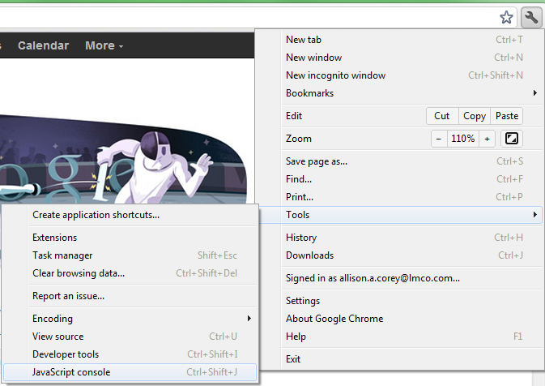
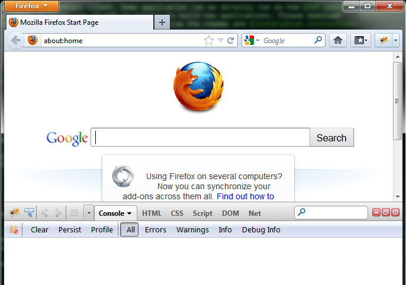

<a name="introduction" />

Introduction
===================
-------------------
The Virtual World Framework (VWF) provides a synchronized collaborative 3D environment for the web browser. VWF allows for easy application creation, and provides a simple interface to allow multiple users to interact with the state of the application that is synchronized across clients. 

VWF leverages existing web-based standards, infrastructure, and emerging technologies with the intent of establishing a powerful yet simple-to-use platform that is built on top of the next generation of web browsers. VWF applications run directly in-browser with no additional plugins.

-------------------

Use the Virtual World Framework (VWF) to create apps that are:

- **3D**
- **Collaborative**
- **Web-based**

... and create them **fast**.

-------------------

Technology
===================
-------------------

The underlying technology of VWF includes:

* WebGL, a high performance rendering engine for 3D on the web.

* Modern javascript and ECMAScript5, a more standardized programming environment.

* WebSockets, providing high performance communication. 

-------------------

Audience
===================
-------------------

The developer's guide is designed for those with web development skills (HTML5, JavaScript, etc), and will serve as a guide to the user creating applications with the Virtual World Framework. 

-------------------

Using VWF
===================
-------------------

The Virtual World Framework is a server package and zero-install client. Demo application can be directly run on the [VWF website](http://virtualworldframework.com/web/catalog.html). A server can be set up locally to build new applications. Please download the source packages from [github](https://github.com/virtual-world-framework/vwf) and follow the readme and [installation instructions](install.html) to start your own server.

-------------------

<a name="compliance" />

What it Means to Use the Virtual World Framework
===================
-------------------

**The following are the basic tasks required to successfully run a genuine VWF application:**

 Download and run the VWF reflector server to provide built-in client synchronization.

 Create a VWF model to maintain the replicated state of the application.

 Include in the model any properties, nodes, methods, and events that should be replicated for all users.

 Run the application in a compatible browser by connecting to the VWF server through the appropriate application URL.

-------------------

<a name="requirements" />

Browser Requirements
===================
-------------------
 
In order to successfully run the Virtual World Framework, the following browser requirements must be met:

*   HTML5
*   ECMAScript5
*   Browser with WebGL enabled (for 3D content)
* Browser with WebSocket enabled for multi-user functionality

The following browsers are recommended for use:

*   [Chrome 27+](https://www.google.com/intl/en/chrome/browser/)
*   [Firefox 21+](http://www.mozilla.org/en-US/firefox/new/)
*   [Opera 15+](http://www.opera.com/developer/next)

-------------------

VWF Compatibility Quirks
===================
-------------------

WINDOWS

*   At this time we have limited support for Internet Explorer 10. Please see our demos of Google Earth and Tile Puzzle 2D to see what can be done with the framework without WebGL.  

*   Internet Explorer 11 is rumored at this time to support WebGL, and we are constantly looking to the future of modern browsers to determine how well the Virtual World Framework is supported.

MACINTOSH OS X

*   Safari 5 is experiencing some issues at this time. We are working through multiple issues with Safari to get VWF and Safari compatibility completed.

*   Firefox 22 Proxy Support for firewalls requires that under Firefox -> Preferences -> Network -> Settings, you must select "Manual Proxy Configuration", and place a check in the "use this proxy server for all protocols" checkbox.

-------------------

Enabling WebGL
===================
-------------------

Use the following steps to verify that WebGL is enabled in your browser.

CHROME

*   Open a new tab and type *chrome://flags* in the address bar.
*   Search for WebGL.
*   Verify *Disable WebGL* is not enabled. 
*   If on an Android device, verify *Enable WebGL Android* is enabled.

FIREFOX

*   Open a new tab and type *about:config* in the address bar. 
*   Search for *WebGL.*
*   Verify *webgl.disabled* is set to false. Alternatively, set *webgl.force-enabled* to true.

-------------------

<a name="troubleshooting" />

Troubleshooting
===================
-------------------

The following resources may be helpful for troubleshooting any issues that arise.

* Verify [installation instructions](install.html) were followed.

* Load an application, and verify all the requirements are met on the loading screen. 

* Open the developer console to check for any error messages. 

  * In Google Chrome, press Ctrl+Shift+J or select the tools menu -> Tools -> Developer Tools -> JavaScript Console. 

  

  * In Mozilla Firefox, download and install [Firebug](https://addons.mozilla.org/en-us/firefox/addon/firebug). Select the bug icon in the upper right of the browser to run, and then select the Console window. 

  

* Search or post a question to the [VWF Forum](http://virtualworldframework.com/web/forum.html) for additional assistance. 

-------------------

Additional Resources
===================
-------------------

Additional information can be found on the [VWF website](http://virtualworldframework.com) and on [wikipedia](http://en.wikipedia.org/wiki/Virtual_world_framework). 

Download the source on [github](https://github.com/virtual-world-framework/vwf). Fork the project and submit pull requests to add new features back to the project.

-------------------

